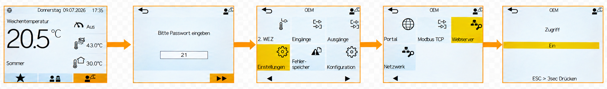
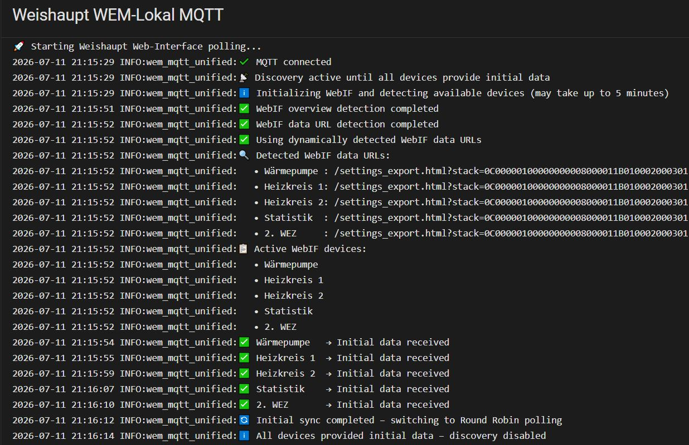
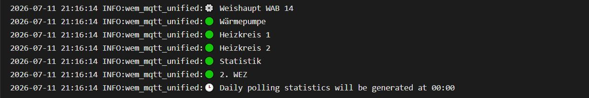

# Weishaupt WEM-Lokal MQTT


Local data extraction from Weishaupt heat pumps via the integrated Weishaupt WEM-Lokal web interface **(WebIF)**, with MQTT integration and full Home Assistant Discovery – fully local and cloud-free.

**Automatically detects the complete WebIF structure and all supported devices without requiring manual HEX configuration, static URLs or model-specific settings.**

---

> ⚠️ **Important for existing users upgrading to v1.1.0**
>
> Version 1.1.0 introduces a simplified configuration and fully automatic WebIF detection.
>
> The app (formerly add-on) no longer requires:
>
> * a manually configured HEX code
> * manually enabled heating circuit options
> * manually enabled statistics or 2. WEZ options
>
> At startup, the app now automatically detects the available WebIF data URLs and all supported devices.
>
> A direct update from v1.0.x to v1.1.0 is supported and the app should continue to run normally.
>
> However, obsolete configuration options from v1.0.x remain stored internally and may generate Supervisor warnings.
>
> **For a clean migration, update to v1.1.0 first, then uninstall the app once and install it again.**
>
> The v1.1.0 app remains available in the Home Assistant App Store, so it does not need to be downloaded again.
>
> After reinstalling, only the WebIF access data and MQTT settings need to be configured.

---

## ✔️ Compatibility

The app communicates exclusively with the local **Weishaupt WEM-Lokal web interface**.
No model-specific configuration is required.

The Weishaupt controller menu calls this function **Webserver**.
In this project and in the app logs, the local web interface is referred to as **WebIF**.

At startup, the app automatically detects:

* the connected heat pump model
* all available heating circuits from HK1 to HK4
* statistics
* the second auxiliary heater (2. WEZ), if available

No manual model selection, HEX code or device configuration is required.

### How to check if your system is compatible

Your system is compatible if:

* your Weishaupt controller includes the **Webserver** menu in the installer/service level, and
* the local **WEM-Lokal WebIF** is enabled.

Menu names, available devices and the WebIF layout may differ slightly depending on the controller type and firmware version.

### Enable the local WebIF

The following steps show how to enable the local WebIF through the **Webserver** menu on the Weishaupt controller:



> ⚠️ **Important:**
>
> Only enable the **Webserver (WebIF)** as shown above.  
> Do not change any other settings in the installer/service level. Incorrect changes may affect system operation and can potentially damage the heat pump.

### Create WebIF username and password

After enabling the **Webserver (WebIF)** on the Weishaupt controller, open the local IP address of the heat pump in your browser.

Example:

```text
http://192.168.178.xx
```

If no WebIF credentials have been configured yet, create a WebIF username and password on the login page.

Keep these credentials safe. They are required later in the app configuration:

* `webinterface_username`
* `webinterface_password`

> ⚠️ **Important:**
>
> After logging in to the local WebIF, do not simply close the browser window.  
> Always use the logout button in the upper-right corner of the WebIF.  
> Otherwise, an active browser session may remain open and can interfere with the app connection.

---

## Overview

This Home Assistant app (formerly add-on) acts as a local polling gateway for the Weishaupt WEM-Lokal WebIF.

It logs in to the local WebIF, automatically detects the available WebIF data URLs and publishes the collected data to Home Assistant via MQTT Discovery.

All supported devices and sensors are created automatically in Home Assistant.

### Data flow

**Weishaupt WebIF → HTTP polling → Python gateway → data normalization → MQTT → Home Assistant Discovery**

The integration was developed to connect Weishaupt heat pump systems to Home Assistant without requiring an official API, cloud access or model-specific configuration.

---

## Features

### Fully local communication

* Direct communication with the Weishaupt controller through the local WEM-Lokal WebIF
* No cloud service required
* No external API required
* No internet connection required for operation

### Automatic WebIF detection

* Automatic detection of the WebIF overview
* Automatic detection of the final WebIF data URLs
* No manually configured HEX code required
* No static WebIF URLs required
* No model-specific URL configuration required

### Automatic device detection

At startup, the app automatically detects the available devices exposed by the WebIF.
Only detected devices are created in Home Assistant and included in the polling sequence:

* Heat pump
* Heating circuits 1 to 4, depending on the system configuration
* Statistics
* Second auxiliary heater (2. WEZ), if available

### Home Assistant integration

* Full MQTT Discovery support
* Automatic creation of devices and sensors
* Automatic device assignment
* Separate Home Assistant devices for the heat pump, heating circuits, statistics and 2. WEZ
* Availability topic and system status monitoring
* Last update timestamp sensor

### Reliability

* Automatic login handling
* Session detection and re-authentication
* Automatic WebIF recovery after session expiration
* Robust HTTP error handling
* Retry handling during initial synchronization
* Round-robin polling
* Daily communication statistics

### Communication quality monitoring

The app tracks the quality of the local WebIF communication.
Daily statistics are published to Home Assistant and written to the app log.

Tracked values:

* First-pass success rate
* Retry-pass success rate
* Failed requests
* Overall daily success rate

---

## Requirements

* Weishaupt heat pump system with local WEM-Lokal WebIF support
* Webserver enabled on the Weishaupt controller
* WebIF username and password configured
* Home Assistant
* MQTT broker, for example Mosquitto
* Network access from Home Assistant to the local WebIF IP address

No HEX code is required.
No manual device selection is required.
All supported WebIF devices are detected automatically at startup.

---

## Installation

### 1. Add the repository

In Home Assistant, open:

**Settings → Apps → Install App → ⋮ → Repositories → Add**

Add the following repository URL:

```text
https://github.com/tiktak29/Weishaupt_WEM-Lokal_MQTT
```

### 2. Install the app

* Select **Weishaupt WEM-Lokal MQTT**
* Install the app
* Open the configuration page
* Enter the required WebIF and MQTT settings
* Save the configuration
* Start the app
* Verify that the startup log completes successfully

### 3. Verify successful startup

During startup, the app should automatically detect the local WebIF structure and the available devices.

A successful startup includes log messages similar to:

```text
✅ WebIF overview detection completed
✅ WebIF data URL detection completed
✅ Using dynamically detected WebIF data URLs
🔍 Detected WebIF data URLs:
📋 Active WebIF devices:
🔄 Initial sync completed – switching to Round Robin polling
ℹ️ All devices provided initial data – discovery disabled
```

After the initial sync is completed, the detected devices and sensors should appear automatically in Home Assistant via MQTT Discovery.

---

## Configuration

Only a few configuration values are required.
The WebIF structure, data URLs and available devices are detected automatically at startup.

### Options

| Parameter                 | Description                                       |
| ------------------------- | ------------------------------------------------- |
| `webinterface_ip_address` | Local IP address of the Weishaupt WEM-Lokal WebIF |
| `webinterface_username`   | WebIF username                                    |
| `webinterface_password`   | WebIF password                                    |
| `mqtt_broker`             | MQTT broker address, for example `core-mosquitto` |
| `mqtt_port`               | MQTT broker port, usually `1883`                  |
| `mqtt_username`           | MQTT username                                     |
| `mqtt_password`           | MQTT password                                     |
| `polling_seconds`         | Polling interval in seconds                       |

> ℹ️ **Note:**
>
> The app automatically detects the WebIF data URLs and all supported devices at startup.  
> No HEX code, static URLs or manual device selection are required.

---

## Startup Log

During startup, the app logs in to the local WebIF, detects the available WebIF structure and creates the active polling configuration automatically.

A successful startup looks similar to this:

```text
🚀 Starting Weishaupt Web-Interface polling...
✔️ MQTT connected
📡 Discovery active until all devices provide initial data
ℹ️ Initializing WebIF and detecting available devices (may take up to 5 minutes)

✅ WebIF overview detection completed
✅ WebIF data URL detection completed
✅ Using dynamically detected WebIF data URLs

🔍 Detected WebIF data URLs:
   • Wärmepumpe   : /settings_export.html?stack=...
   • Heizkreis 1  : /settings_export.html?stack=...
   • Heizkreis 2  : /settings_export.html?stack=...
   • Statistik    : /settings_export.html?stack=...
   • 2. WEZ       : /settings_export.html?stack=...

📋 Active WebIF devices:
   • Wärmepumpe
   • Heizkreis 1
   • Heizkreis 2
   • Statistik
   • 2. WEZ

✅ Wärmepumpe   → Initial data received
✅ Heizkreis 1  → Initial data received
✅ Heizkreis 2  → Initial data received
✅ Statistik    → Initial data received
✅ 2. WEZ       → Initial data received

🔄 Initial sync completed – switching to Round Robin polling
ℹ️ All devices provided initial data – discovery disabled
📋 Summary of all devices:
⚙️ Weishaupt WAB 14
🟢 Wärmepumpe
🟢 Heizkreis 1
🟢 Heizkreis 2
🟢 Statistik
🟢 2. WEZ
🕒 Daily polling statistics will be generated at 00:00
```

The detected devices automatically adapt to the connected Weishaupt system configuration.

For example, systems without HK2, HK3, HK4, statistics or 2. WEZ will only show the devices that are actually available.

---

## Daily Statistics

The app tracks the communication quality of the local WebIF polling during operation.

Once per day at midnight, the app generates a daily statistics summary for the previous day.

Example:

```text
🕒 Creating daily statistics for Tue, 2026-06-30
 Wärmepumpe:
  First-pass success rate:  90.1 % (3092)
  Retry-pass success rate:   8.6 % (295)
  Overall failure rate:      1.3 % (46)
  Overall success rate:     98.7 % (3387/3433)

 Heizkreis 1:
  First-pass success rate:  91.6 % (899)
  Retry-pass success rate:   7.3 % (72)
  Overall failure rate:      1.0 % (10)
  Overall success rate:     99.0 % (971/981)

 Heizkreis 2:
  First-pass success rate:  91.0 % (892)
  Retry-pass success rate:   7.6 % (74)
  Overall failure rate:      1.4 % (14)
  Overall success rate:     98.6 % (966/980)

 Statistik:
  First-pass success rate:  91.4 % (897)
  Retry-pass success rate:   6.9 % (68)
  Overall failure rate:      1.6 % (16)
  Overall success rate:     98.4 % (965/981)

 2. WEZ:
  First-pass success rate:  91.2 % (448)
  Retry-pass success rate:   7.9 % (39)
  Overall failure rate:      0.8 % (4)
  Overall success rate:     99.2 % (487/491)

 Overall system:
  First-pass success rate:  90.7 % (6228)
  Retry-pass success rate:   8.0 % (548)
  Overall failure rate:      1.3 % (90)
  Overall success rate:     98.7 % (6776/6866)

🕒 Daily statistics generated for Tue, 2026-06-30
```

The daily success rate is also published to Home Assistant via MQTT.

---

## ⚠️ Important Operating Notice

While the app is running, you should not access the heat pump's local WebIF through a browser at the same time.

The local WebIF supports only a limited number of concurrent sessions. Parallel browser sessions and app polling may interfere with each other and can make the WebIF unstable.

If you need to access the WebIF manually:

* stop the app first, or
* log out from the WebIF properly before starting the app again.

In rare cases, an unstable WebIF session may require restarting the Weishaupt controller.

### ✅ Cloud access unaffected

The official Weishaupt WEM Portal can still be used independently of this app.

This app communicates exclusively with the local WebIF and does not use the Weishaupt cloud or internet services.

---

## Feedback & Compatibility Reports

To help improve compatibility across different Weishaupt WEM configurations, please share your setup and test results in the discussion thread:

➡️ **[Feedback: Tested WEM-Lokal Heat Pump Configurations](https://github.com/tiktak29/Weishaupt_WEM-Lokal_MQTT/discussions/1)**

Useful information includes:

* heat pump model
* controller model
* controller firmware version
* available heating circuits
* whether statistics or 2. WEZ are detected
* startup log
* any unusual WebIF behavior

Every compatibility report helps improve support for additional controller generations and firmware versions.

---

## Screenshots

### Example Dashboard

The following dashboard shows an example of automatically detected Weishaupt WEM-Lokal devices and sensors in Home Assistant.


---

### Example Startup Log

The startup log shows the automatic WebIF detection, device discovery and successful initialization.




---

### Example Daily Statistics

The app automatically generates daily communication statistics at midnight, providing an overview of polling quality and overall communication reliability.


---

## Changelog

See: [CHANGELOG.md](./CHANGELOG.md)

---

## License

This project is released under the **MIT License**.

See: [LICENSE](./LICENSE)

---

## Thanks

Many thanks to everyone who tests, improves and extends this project.

Special thanks to all users who provide compatibility reports, startup logs and valuable feedback from different Weishaupt WEM installations.

Your reports have been essential for making the automatic WebIF detection reliable across different controller models and firmware versions.

---

## Disclaimer

This project is an independent open-source project and is not affiliated with Weishaupt GmbH.

It is provided **"as is"**, without warranty of any kind, express or implied.

Use this software entirely at your own risk.

The developers assume no liability for any damage, malfunction, data loss or incorrect system behavior resulting from the installation or use of this software.

Always verify configuration changes before operating your heating system.
