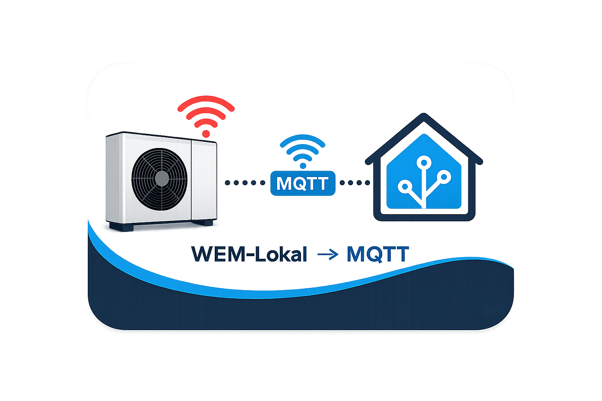
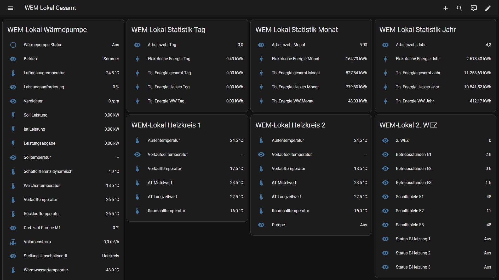
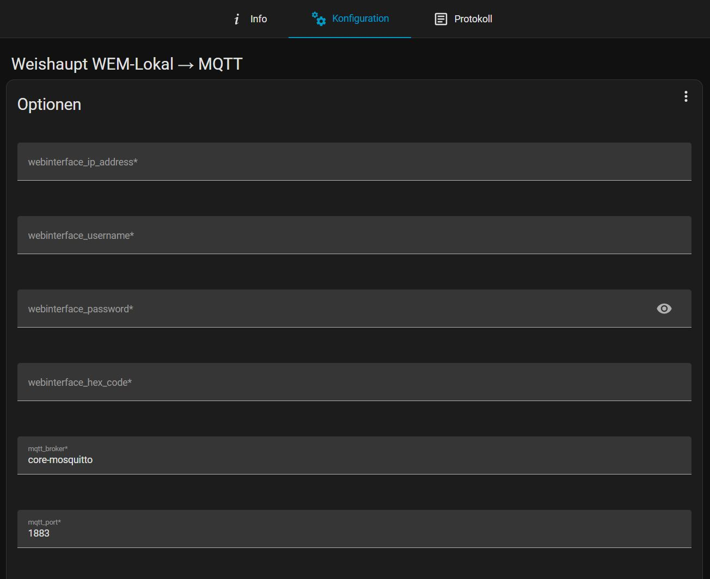
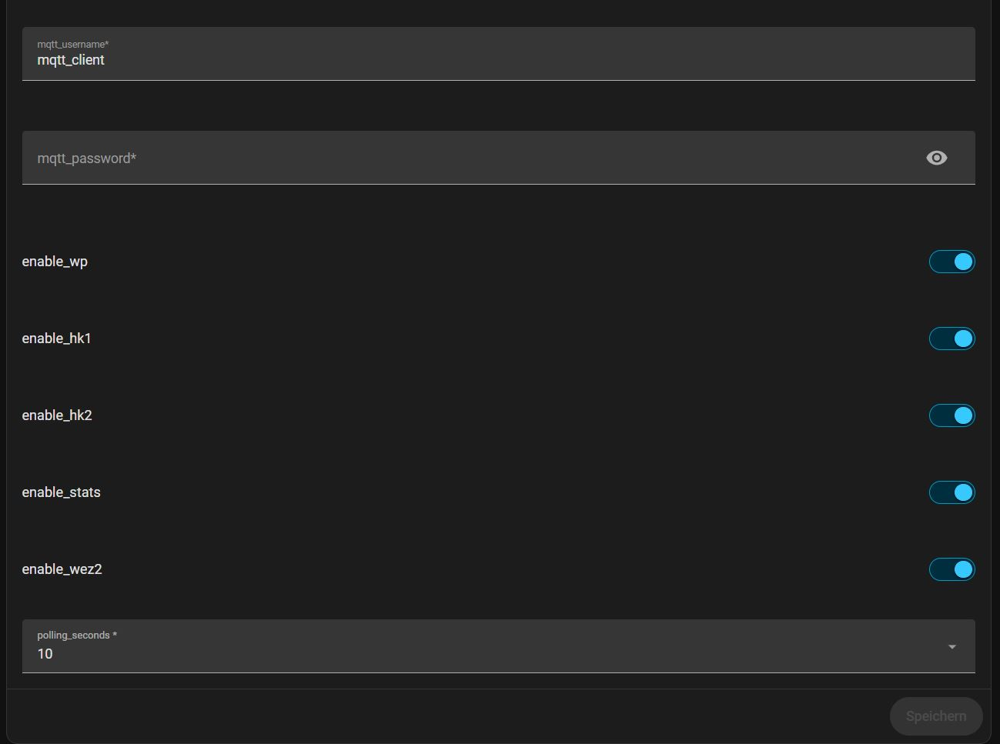
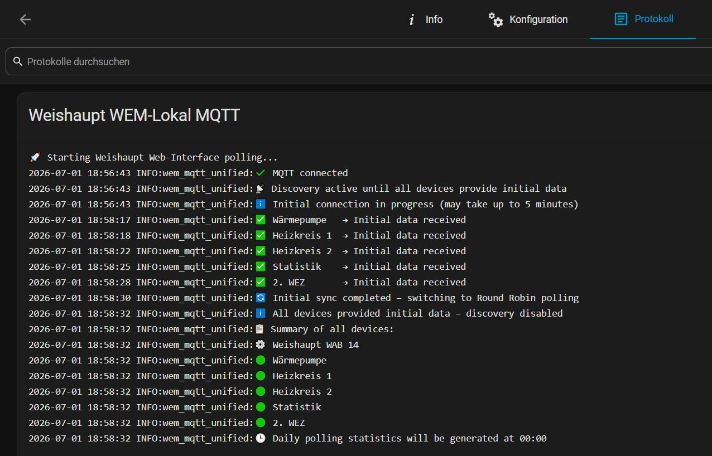
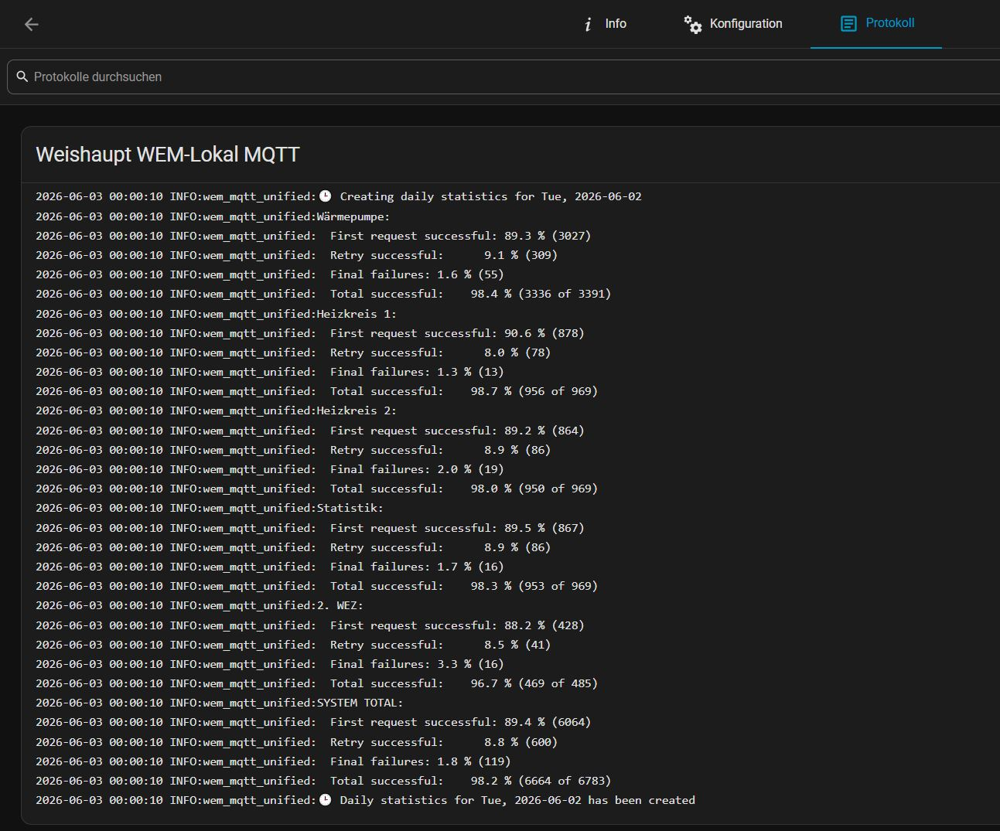
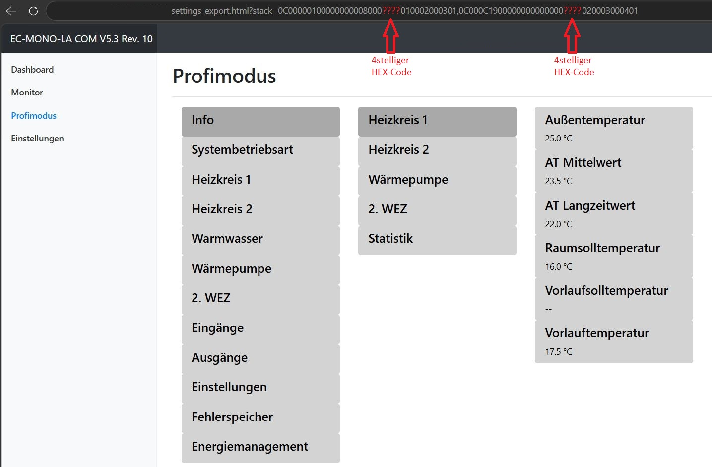

  

# Weishaupt WEM‑Lokal → MQTT  

  

Local data extraction from Weishaupt heat pumps via the integrated Weishaupt controller web interface, with MQTT integration and full Home Assistant Discovery – fully local and cloud‑free.

---

## Feedback & Compatibility Reports

To help improve compatibility across different Weishaupt WEM configurations, please share your setup and results in the discussion thread:

➡️ **[Feedback: Tested WEM-Lokal Heat Pump Configurations](https://github.com/tiktak29/Weishaupt_WEM-Lokal_MQTT/discussions/1)**

#### Tested with a Weishaupt WAB 14 (EC WAB V5.3 R10 / WWP‑SG V5.0)

---

## Overview
This integration acts as a local polling gateway that reads data from the Weishaupt WEM web interface and publishes it to Home Assistant via MQTT Discovery.  
All devices and sensors are automatically created in Home Assistant through **MQTT Discovery**.
 
#### Weishaupt Web UI → HTTP scraping → Python gateway → data normalization → MQTT → Home Assistant Discovery  
Developed to integrate Weishaupt systems into modern Home Assistant environments without requiring any official API access.

---

- Fully local communication  
- No cloud services involved  
- No external APIs or accounts required  
- Operates solely via the local Weishaupt web interface

---

## Requirements
- Weishaupt heat pump with up‑to‑date firmware  
- Web interface: Webserver must be enabled on the controller (ensure before installing the app)  
- Web interface: Username and password must be created and known (ensure before installing the app)  
- Web interface: 4‑digit HEX code must be known (ensure before installing the app)  
- Home Assistant  
- MQTT broker (e.g., Mosquitto)  

Note: Additional information regarding the web interface is provided in the lower section of this document.

---

## Features

### Local Communication
- Direct access to the Weishaupt controller via the integrated web interface  
- No cloud connection required  
- No internet connection required for operation  
- Direct communication within the local network  

### Home Assistant Integration
- Full MQTT Discovery support  
- Automatic creation of all devices and sensors  
- Automatic device assignment in Home Assistant  
- Automatic updates of sensors and entities  
- Support for current and legacy MQTT libraries (paho‑mqtt API v1/v2)  

### Supported Devices
- Heat pump  
- Heating circuit 1  
- Heating circuit 2  
- Statistics  
- Second auxiliary heater (WEZ2)  

### Reliability
- Automatic session re‑authentication  
- Retry mechanism for empty or incomplete responses  
- Robust HTTP error handling  
- Automatic recovery after communication failures  
- Round‑robin polling to reduce load on the web interface  

### Advanced Features
- Automatic heat pump model detection  
- Dynamic activation of individual device sections  
- Daily communication and success statistics in the log  
- Optional MQTT availability / last‑will status (online/offline)  
- Fully local operation without external dependencies
  

---

## Installation

### **1. Add the repository**
In Home Assistant:

**Settings → Apps → Install App → ⋮ → Repositories → Add → Enter URL → Add**

Repository URL:  
https://github.com/tiktak29/Weishaupt_WEM-Lokal_MQTT

### **2. Install the app**
- Select “Weishaupt WEM‑Local MQTT”  
- Install  
- Configure  
- Start  
- Check logs
  
---

## Configuration

### **Options (config.json)**

| Parameter | Description |
|----------|-------------|
| `webinterface_ip_address` | web interface IP address |
| `webinterface_username` | web interface username |
| `webinterface_password` | web interface password |
| `webinterface_hex_code` | 4‑digit HEX code from the URL |
| `mqtt_broker` | MQTT broker (e.g., core‑mosquitto) |
| `mqtt_port` | MQTT port |
| `mqtt_username` | MQTT username |
| `mqtt_password` | MQTT password |
| `polling_seconds` | Polling interval in seconds |
| `enable_wp` | Heat pump |
| `enable_hk1` | Heating circuit 1 |
| `enable_hk2` | Heating circuit 2 |
| `enable_stats` | Statistics |
| `enable_wez2` | Second auxiliary heater (WEZ2) |

  

---
## Startup Log

---

## Daily Statistics Log

---

## Important Notice

⚠️ While the app is running, you should not access the web interface of the heat pump via a browser at the same time.

Parallel data requests may cause the web interface of the heat pump to become unstable.

In rare cases, this may lead to the controller becoming unresponsive, requiring a restart of the heat pump controller before it becomes operational and reachable again.

Therefore, it is recommended to avoid additional browser access to the web interface while the app is running.

---

## 1. Enable the web interface
[Instructions in the Home Assistant Community Forum](https://community.home-assistant.io/t/weishaupt-heatpump-integration-via-modbus/436823/210?page=13)
  

## 2. Create web interface username and password
Open the local IP address of the heat pump in your browser (e.g., http://192.168.178.xx), create a username and set a password.  
These credentials are required in the app configuration as the web interface username and password.
  

## 3. Determine the 4‑digit HEX code
Open the web interface in your browser.  
Navigate to: Expert Mode → Info → Heating Circuit 1  
The browser will show a URL similar to:
http://192.168.178.xx/settings_export.html?stack=0C00000100000000008000????010002000301,0C000C1900000000000000????020003000401  
The `????` in both blocks represent the 4‑digit HEX code.

The HEX code must be identical in both URL blocks and is required in the app configuration as `webinterface_hex_code`.

---

## Changelog

See: [CHANGELOG.md](./CHANGELOG.md)

---

## License

This project uses the **MIT License**.  
See: [LICENSE](./LICENSE)

---

## Thanks

Thanks to everyone who tests, improves, and extends this project.  
Feedback and suggestions are welcome.

---

  

## Disclaimer
This project is an independent open‑source project and is not affiliated with Weishaupt GmbH.

The app was developed in spare time based on publicly available information.  
Use at your own risk and responsibility.  

The developers assume no liability for any damage or malfunction caused by the use of this app.

---
