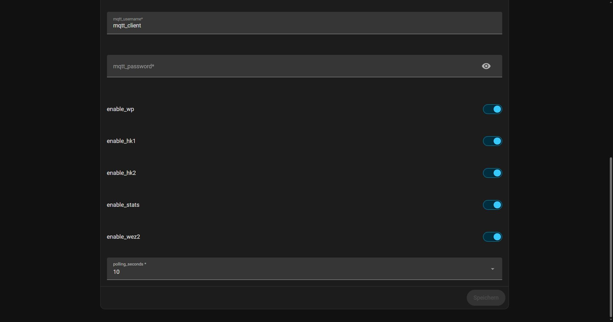

# Weishaupt WEM‑Lokal → MQTT  
Lokale Auslesung von Weishaupt WEM‑Wärmepumpen über das integrierte Web‑Interface der Weishaupt Regelung mit MQTT‑Integration und vollständiger Home‑Assistant‑Discovery – komplett ohne Cloud.

#### Gestestet mit Weishaupt Wärmepumpe WAB 14 - Version EC WAB V5.3 R10 - Version WWP-SG V5.0

---

## Überblick
Diese Home‑Assistant App (vorher Add‑on) liest alle relevanten Daten einer **Weishaupt Wärmepumpe** direkt über das **lokale Web‑Interface** der Steuerung aus und stellt sie über **MQTT** bereit.  
Alle Geräte und Sensoren werden automatisch per **MQTT Discovery** in Home Assistant angelegt. 

---
 
✔ Keine Cloud  
✔ Keine API‑Keys  
✔ Keine Abhängigkeiten von Weishaupt‑Servern  
✔ 100% lokal

---

## Voraussetzungen
- Weishaupt Wärmepumpe mit aktueller Software
- Web-Interface in der Regelung eingeschaltet (Vor der Installation sicherstellen, siehe unten)
- Web-Interface Benutzer angelegt (Vor Installation der sicherstellen, siehe unten)
- Web-Interface 4stelliger HEX-Code bekannt (Vor der Installation sicherstellen, siehe unten) 
- Home Assistant  
- MQTT‑Broker (z. B. Mosquitto)  

---
## Funktionen

### Lokale Kommunikation
- Direkter Zugriff auf die Weishaupt-Regelung über das integrierte Web-Interface  
- Keine Cloud-Anbindung erforderlich  
- Keine API-Schlüssel oder Herstellerkonten notwendig  
- Keine Internetverbindung für den Betrieb erforderlich  
- Direkte Kommunikation innerhalb des lokalen Netzwerks  

### Home Assistant Integration
- Vollständige MQTT Discovery  
- Automatische Erstellung aller Geräte und Sensoren  
- Automatische Gerätezuordnung in Home Assistant  
- Automatische Aktualisierung von Sensoren und Entitäten  
- Unterstützung für aktuelle und ältere MQTT-Bibliotheken (paho-mqtt API v1/v2)  

### Unterstützte Geräte
- Wärmepumpe  
- Heizkreis 1  
- Heizkreis 2  
- Statistik  
- 2.WEZ  

### Zuverlässigkeit
- Automatische Wiederanmeldung bei Session-Verlust  
- Retry-Mechanismus bei leeren oder unvollständigen Antworten  
- Robuste HTTP-Fehlerbehandlung  
- Automatische Wiederherstellung nach Kommunikationsfehlern  
- Round-Robin-Abfrage zur Entlastung des Web-Interfaces  

### Erweiterte Funktionen
- Automatische Modell-Erkennung der Wärmepumpe 
- Dynamische Aktivierung einzelner Gerätebereiche  
- Tägliche Kommunikations- und Erfolgsstatistik im Log  
- Optionaler MQTT Availability-/Last-Will-Status (online/offline)  
- Vollständig lokaler Betrieb ohne externe Abhängigkeiten  

---

## Installation

### **1. Repository hinzufügen**
In Home Assistant:

**Einstellungen → Apps → App installieren → ⋮ → Repositories**

Repository‑URL: https://github.com/tiktak29/Weishaupt_WEM-Lokal_MQTT

### **2. App installieren**
- „Weishaupt WEM‑Lokal MQTT“ auswählen  
- Installieren
- Konfigurieren  
- Starten  
- Logs prüfen  

---

## Konfiguration

### **Optionen (config.json)**

| Parameter | Beschreibung |
|----------|--------------|
| `webinterface_ip_address` | IP-Adresse Webinterface |
| `webinterface_username` | Benutzername |
| `webinterface_password` | Passwort |
| `webinterface_hex_code` | HEX‑Code aus der URL Webinterface |
| `mqtt_broker` | MQTT‑Broker (z. B. core-mosquitto) |
| `mqtt_port` | Port |
| `mqtt_username` | Benutzer |
| `mqtt_password` | Passwort |
| `polling_seconds` | Abfrageintervall |
| `enable_wp` | Wärmepumpe |
| `enable_hk1` | Heizkreis 1 |
| `enable_hk2` | Heizkreis 2 |
| `enable_stats` | Statistik |
| `enable_wez2` | 2.WEZ |

---

## 1. Web-Interface aktivieren
Eine Anleitung dazu gibt es hier:
https://community.home-assistant.io/t/weishaupt-heatpump-integration-via-modbus/436823/210?page=13
  
## 2. Web-Interface Benutzer und Kennwort anlegen
Lokale IP (Beispiel: http://192.168.178.xx) der Wärmepumpe im Browser aufrufen, Benutzer anlegen und Passwort vergeben
  
## 3. Web-Interface 4stellige HEX-Zahl ermitteln
Benutzeroberfläche vom Web-Interface im Browser öffnen.  
Auswählen: Profimodus → Info → Heizkreis 1
Oben im Browser wird die URL angezeigt.  
Beispiel: http://192.168.178.89/settings_export.html?stack=0C00000100000000008000HHHH010002000301,0C000C1900000000000000HHHH020003000401  
Im ersten und zweiten Block HHHH ist der 4stellige HEX-Code.  

Der vierstellige HEX-Code muss in beiden URL-Blöcken identisch sein und wird in der App-Konfiguration als webinterface_hex_code eingetragen.

---

## Changelog

Siehe: [CHANGELOG.md](./CHANGELOG.md)

---

## Lizenz

Dieses Projekt verwendet die **MIT‑Lizenz**.  
Siehe: [LICENSE](./LICENSE)

---

## Hinweis

Dies ist ein **inoffizielles Open‑Source‑Projekt**.  
Es besteht **keine Verbindung zur Weishaupt GmbH**.

---

## Danke

Danke an alle, die dieses Projekt testen, verbessern und erweitern.  
Feedback und Verbesserungsvorschläge sind willkommen.

