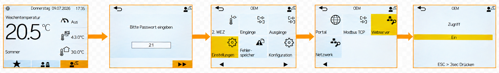
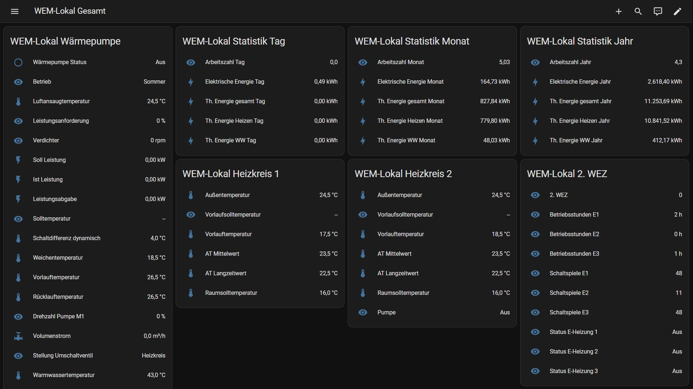
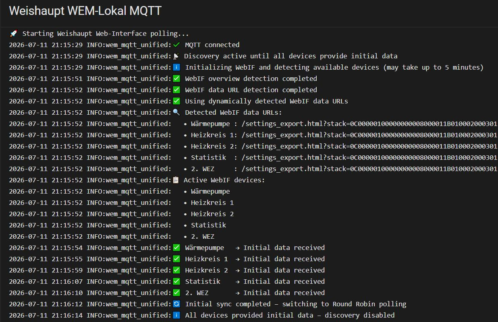
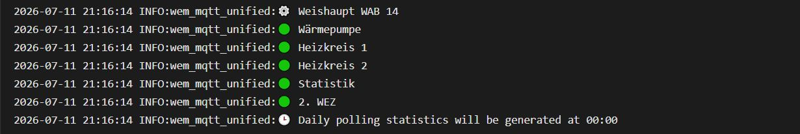
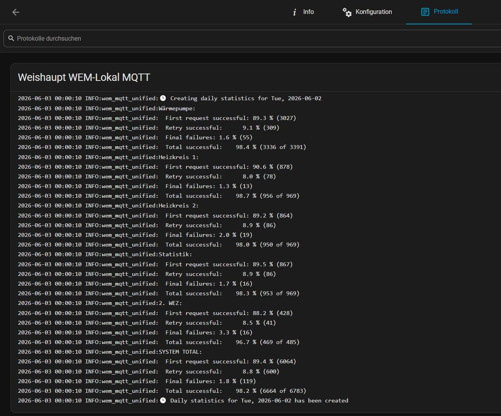

# Weishaupt WEM-Lokal MQTT


Local data extraction from Weishaupt heat pumps via the integrated Weishaupt WEM-Lokal web interface **(WebIF)**, with MQTT integration and full Home Assistant Discovery – fully local and cloud-free.

**Automatically detects the complete WebIF structure and all supported devices without requiring manual HEX configuration, static URLs or model-specific settings.**

---

> ℹ️ **Updating from v1.1.0 to v1.1.1**
>
> The configuration options and schema are unchanged. Use the normal Home Assistant app update; no uninstall or reconfiguration is required for this update.
>
> The first start after updating from v1.1.0 establishes and validates a new WebIF session because v1.1.0 did not save session cookies. Subsequent restarts and updates can reuse the saved session after validation.
>
> Keep the app's data when updating. Uninstalling removes the saved session and requires a fresh login on the next installation.

> ⚠️ **Legacy migration from v1.0.x**
>
> Version 1.1.0 introduced fully automatic WebIF detection and removed the manual HEX code and device-enable options.
>
> Obsolete v1.0.x options may remain stored and generate Supervisor warnings. If these old options are still present, note your WebIF and MQTT settings before uninstalling and reinstalling the current app to remove them.
>
> This legacy cleanup does not apply to a normal v1.1.0 → v1.1.1 update.

---

## ✔️ Compatibility

The app communicates exclusively with the local **Weishaupt WEM-Lokal web interface**.
No model-specific configuration is required.

The Weishaupt controller menu calls this function **Webserver**.
In this project and in the app logs, the local web interface is referred to as **WebIF**.

At startup, the app automatically detects:

* the connected heat pump model
* all available heating circuits from HK1 to HK4
* statistics
* the second auxiliary heater (2. WEZ), if available

No manual model selection, HEX code or device configuration is required.

### How to check if your system is compatible

Your system is compatible if:

* your Weishaupt controller includes the **Webserver** menu in the installer/service level, and
* the local **WEM-Lokal WebIF** is enabled.

Menu names, available devices and the WebIF layout may differ slightly depending on the controller type and firmware version.

### Enable the local WebIF

The following steps show how to enable the local WebIF through the **Webserver** menu on the Weishaupt controller:



> ⚠️ **Important:**
>
> Only enable the **Webserver (WebIF)** as shown above.  
> Do not change any other settings in the installer/service level. Incorrect changes may affect system operation and can potentially damage the heat pump.

### Create WebIF username and password

After enabling the **Webserver (WebIF)** on the Weishaupt controller, open the local IP address of the heat pump in your browser.

Example:

```text
http://192.168.178.xx
```

If no WebIF credentials have been configured yet, create a WebIF username and password on the login page.

Keep these credentials safe. They are required later in the app configuration:

* `webinterface_username`
* `webinterface_password`

> ⚠️ **Important:**
>
> After logging in to the local WebIF, do not simply close the browser window.  
> Always use the logout button in the upper-right corner of the WebIF.  
> Otherwise, an active browser session may remain open and can interfere with the app connection.

---

## Overview

This Home Assistant app (formerly add-on) acts as a local polling gateway for the Weishaupt WEM-Lokal WebIF.

It validates a saved WebIF session or establishes a new one, automatically detects the available WebIF data URLs and publishes the collected data to Home Assistant via MQTT Discovery.

All supported devices and sensors are created automatically in Home Assistant.

### Data flow

**Weishaupt WebIF → HTTP polling → Python gateway → data normalization → MQTT → Home Assistant Discovery**

The integration was developed to connect Weishaupt heat pump systems to Home Assistant without requiring an official API, cloud access or model-specific configuration.

---

## Features

### Fully local communication

* Direct communication with the Weishaupt controller through the local WEM-Lokal WebIF
* No cloud service required
* No external API required
* No internet connection required for operation

### Automatic WebIF detection

* Automatic detection of the WebIF overview
* Automatic detection of the final WebIF data URLs
* No manually configured HEX code required
* No static WebIF URLs required
* No model-specific URL configuration required

### Automatic device detection

At startup, the app automatically detects the available devices exposed by the WebIF.
Only detected devices are created in Home Assistant and included in the polling sequence:

* Heat pump
* Heating circuits 1 to 4, depending on the system configuration
* Statistics
* Second auxiliary heater (2. WEZ), if available

### Home Assistant integration

* Full MQTT Discovery support
* Automatic creation of devices and sensors
* Automatic device assignment
* Separate Home Assistant devices for the heat pump, heating circuits, statistics and 2. WEZ
* Availability topic and system status monitoring
* Last update timestamp sensor
* WebIF status diagnostic sensor for connection and recovery states

### Reliability

* Automatic login handling with protected-page session validation
* Persistent storage of validated WebIF sessions for reuse after restarts and updates
* Existing-session validation before a replacement login
* Separate handling of transport interruptions and rejected sessions
* Recovery pauses with checks after 15 minutes for the first four attempts, then after 30 minutes
* Robust HTTP error handling and retry handling during initial synchronization
* Round-robin polling
* Daily communication statistics and a 90-second WebIF rest with the session cookie preserved

### Communication quality monitoring

The app tracks first-pass successes, retry successes and failed polls internally.
The public app log reports a compact daily summary with the overall success rate, successful polls, total polls and failed polls.

The previous day's overall success rate and counts are also published to Home Assistant via MQTT and saved for display after an app restart.

---

## Requirements

* Weishaupt heat pump system with local WEM-Lokal WebIF support
* Webserver enabled on the Weishaupt controller
* WebIF username and password configured
* Home Assistant
* MQTT broker, for example Mosquitto
* Network access from Home Assistant to the local WebIF IP address

No HEX code is required.
No manual device selection is required.
All supported WebIF devices are detected automatically at startup.

---

## Installation

### 1. Add the repository

In Home Assistant, open:

**Settings → Apps → Install App → ⋮ → Repositories → Add**

Add the following repository URL:

```text
https://github.com/tiktak29/Weishaupt_WEM-Lokal_MQTT
```

### 2. Install the app

* Select **Weishaupt WEM-Lokal MQTT**
* Install the app
* Open the configuration page
* Enter the required WebIF and MQTT settings
* Save the configuration
* Start the app
* Verify that the startup log completes successfully

### 3. Verify successful startup

During startup, the app validates the WebIF session and automatically detects the available devices.

A successful startup includes messages similar to:

```text
✅ WebIF devices detected: Wärmepumpe, Heizkreis 1, Heizkreis 2, Statistik, 2. WEZ
✅ Initial sync completed – Round Robin active
```

The preceding session messages depend on whether a saved session is available; both normal paths are shown in [Startup Log](#startup-log).
The device list adapts to the connected system. Detected devices and sensors appear automatically in Home Assistant via MQTT Discovery as their initial data becomes available.

---

## Configuration

Only a few configuration values are required.
The WebIF structure, data URLs and available devices are detected automatically at startup.

### Options

| Parameter                 | Description                                       |
| ------------------------- | ------------------------------------------------- |
| `webinterface_ip_address` | Local IP address of the Weishaupt WEM-Lokal WebIF |
| `webinterface_username`   | WebIF username                                    |
| `webinterface_password`   | WebIF password                                    |
| `mqtt_broker`             | MQTT broker address, for example `core-mosquitto` |
| `mqtt_port`               | MQTT broker port, usually `1883`                  |
| `mqtt_username`           | MQTT username                                     |
| `mqtt_password`           | MQTT password                                     |
| `polling_seconds`         | Polling interval in seconds                       |

> ℹ️ **Note:**
>
> The app automatically detects the WebIF data URLs and all supported devices at startup.  
> No HEX code, static URLs or manual device selection are required.

---

## Startup Log

There are two normal startup paths. The examples below omit the timestamp and logger prefix for readability.
The measured times are real test examples, not guaranteed startup durations.

### First installation / no saved session

When no usable saved session is available, the app establishes a new login and validates it on a protected WebIF page:

```text
🚀 Starting Weishaupt WEM-Lokal MQTT v1.1.1
✔️ MQTT connected
ℹ️ Establishing WebIF session – this may take up to 5 minutes
✅ WebIF session validated in 6.4 s
✅ WebIF devices detected: Wärmepumpe, Heizkreis 1, Heizkreis 2, Statistik, 2. WEZ
✅ Initial sync completed – Round Robin active
```

Only a session cookie that has passed protected-page validation is saved in `/data/webif_session.json`.
This path also applies to the first update from v1.1.0, which did not persist session cookies.

If setup is still incomplete when the 120-second threshold is checked, the app logs this once:

```text
⚠️ WebIF session setup is taking longer than expected – continuing for up to 5 minutes
```

A longer successful validation may report `✅ WebIF session validated in 131.8 s`.
If setup fails within the configured five-minute window, the app logs:

```text
❌ WebIF session could not be established within 5 minutes
```

### Restart / update with a saved session

The app loads the saved session and validates it on a protected WebIF page before considering a new login:

```text
🚀 Starting Weishaupt WEM-Lokal MQTT v1.1.1
✔️ MQTT connected
ℹ️ Checking existing WebIF session
✅ Existing WebIF session validated in 0.8 s
✅ WebIF devices detected: Wärmepumpe, Heizkreis 1, Heizkreis 2, Statistik, 2. WEZ
✅ Initial sync completed – Round Robin active
```

If the saved session is accepted, no new WebIF login is performed. This avoids unnecessary new logins and session cookies during app restarts and updates.
Session reuse has been tested with Stop → Start and a normal Home Assistant app update.

### Saved session while the WebIF is temporarily unreachable

A transport error does not prove that the saved cookie is invalid. The app keeps the cookie and retries validation without creating a new login.
In a real test with the Webserver initially switched off, the same cookie was accepted after the Webserver was switched on again:

```text
✅ Existing WebIF session validated in 42.2 s
```

If validation is still pending when the 120-second threshold is checked, the app logs this once:

```text
⚠️ Existing WebIF session could not yet be validated – continuing for up to 5 minutes
```

If the configured five-minute validation window expires, the app logs:

```text
❌ Existing WebIF session could not be validated within 5 minutes – saved session retained
```

The saved cookie is retained and this startup attempt ends. The startup timeout does not enter the runtime recovery loop.
For saved-session validation, timing thresholds are checked between HTTP requests; an in-flight request can delay the warning or the end of the window.

### Saved session explicitly rejected

If the protected WebIF page returns the login page, the app discards the rejected saved cookie and uses the normal fresh-login path:

```text
ℹ️ Existing WebIF session rejected – establishing a new WebIF session
ℹ️ Establishing WebIF session – this may take up to 5 minutes
```

After successful validation, the new cookie is saved again.

Device detection, initial synchronization, Round Robin, retries, runtime session revalidation, transport recovery and the daily WebIF rest follow their existing runtime paths after startup.
The detected devices adapt to the connected system; unavailable optional devices are omitted.

---

## Daily Statistics

The app tracks the communication quality of the local WebIF polling during operation.
During normal polling, the first day-change check after midnight generates the previous day's summary.

Illustrative public-log example:

```text
🕒 [2026-06-30] Daily statistics – 98.7% successful (6776/6866 polls, 90 failed)
✅ [2026-06-30] Daily WebIF rest completed – 90 s, session preserved
```

The daily success rate and totals are also published to Home Assistant via MQTT.
After the statistics are generated, the app pauses WebIF requests for 90 seconds and recreates the HTTP client while preserving the WebIF session cookie. Polling then resumes without a login caused by the rest itself.
This scheduled pause is expected and is not a WebIF outage.

---

## ⚠️ Important Operating Notice

While the app is running, you should not access the heat pump's local WebIF through a browser at the same time.

The local WebIF supports only a limited number of concurrent sessions. Parallel browser sessions and app polling may interfere with each other and can make the WebIF unstable.

If you need to access the WebIF manually:

* stop the app first, or
* log out from the WebIF properly before starting the app again.

During runtime, a session problem first triggers validation of the existing cookie. Transport interruptions are handled separately and do not by themselves invalidate it.
If immediate recovery fails, the app enters recovery mode: the first four checks follow 15-minute pauses, with 30-minute pauses thereafter. The app first tries the existing session; replacement logins in long recovery are rate-limited.

The **WebIF-Status** diagnostic sensor shows connection and recovery states. The app marks MQTT availability offline during long recovery and restores it after successful recovery.

If the WebIF remains unavailable, the app log advises restarting only the **Webserver** function in the Weishaupt controller: set Webserver to OFF, wait 60 seconds, then set it to ON.

### ✅ Cloud access unaffected

The official Weishaupt WEM Portal can still be used independently of this app.

This app communicates exclusively with the local WebIF and does not use the Weishaupt cloud or internet services.

---

## Feedback & Compatibility Reports

To help improve compatibility across different Weishaupt WEM configurations, please share your setup and test results in the discussion thread:

➡️ **[Feedback: Tested WEM-Lokal Heat Pump Configurations](https://github.com/tiktak29/Weishaupt_WEM-Lokal_MQTT/discussions/1)**

Useful information includes:

* heat pump model
* controller model
* controller firmware version
* available heating circuits
* whether statistics or 2. WEZ are detected
* startup log
* any unusual WebIF behavior

Every compatibility report helps improve support for additional controller generations and firmware versions.

---

## Screenshots

### Example Dashboard

The following dashboard shows an example of automatically detected Weishaupt WEM-Lokal devices and sensors in Home Assistant.



---

### Example Startup Log

The following screenshots show the earlier v1.1.0 log format. For the current v1.1.1 public log and both startup paths, see [Startup Log](#startup-log).




---

### Example Daily Statistics

The following screenshot shows the earlier detailed v1.1.0 log format. The current v1.1.1 summary and daily rest message are shown in [Daily Statistics](#daily-statistics).



---

## Changelog

See: [CHANGELOG.md](./CHANGELOG.md)

---

## License

This project is released under the **MIT License**.

See: [LICENSE](./LICENSE)

---

## Thanks

Many thanks to everyone who tests, improves and extends this project.

Special thanks to all users who provide compatibility reports, startup logs and valuable feedback from different Weishaupt WEM installations.

Your reports have been essential for making the automatic WebIF detection reliable across different controller models and firmware versions.

---

## Disclaimer

This project is an independent open-source project and is not affiliated with Weishaupt GmbH.

It is provided **"as is"**, without warranty of any kind, express or implied.

Use this software entirely at your own risk.

The developers assume no liability for any damage, malfunction, data loss or incorrect system behavior resulting from the installation or use of this software.

Always verify configuration changes before operating your heating system.
